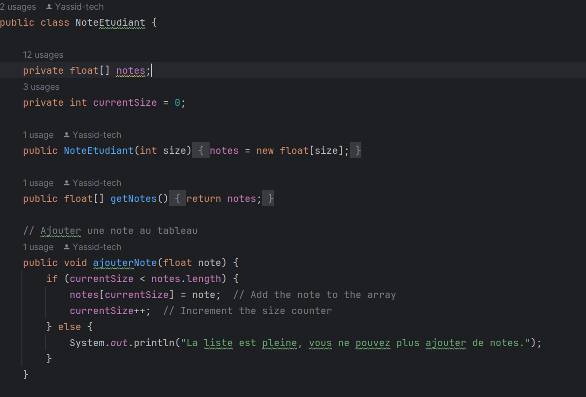

# Lab Report TP1 - Arrays and Strings

## Master in Distributed Systems and Artificial Intelligence  
**Academic Year:** 2024-2025  
**Prepared by:** Yassine IDRISSI  

---

### 1. Objectives of the Practical Assignment

The goal of this assignment is to manipulate arrays and strings in Java, involving:

- **Manipulating Arrays to Store and Process Numerical Data (Student Grades):**
  - Sort an array.
  - Calculate statistics from an array (average, maximum, minimum).
  - Search for specific occurrences in an array.

- **Manipulating Strings (Specifically First-Group French Verbs for Conjugation):**
  - Identify and validate first-group verbs.
  - Conjugate these verbs for different personal pronouns.

- **Performing Various Operations on a User-Entered String:**
  - Implement an interactive menu for string management.
  - Perform operations like reversing a string and counting words.

- **Counting Letter Occurrences in a String (Case-Insensitive):**
  - Use an array to store and display occurrences of each alphabet letter.

---

### 2. Materials and Development Environment

- **Programming Language:** Java  
- **Development Environment:** IntelliJ  
- **JDK:** 17  

---

### 3. Description of Exercises and Results

#### Exercise 1: Manipulating Grades with an Array

1. **Creation of the `NoteEtudiant` Class:**  
   This class manages a grade array and performs the required operations. The array is initialized with a fixed size for the number of students.

2. **Adding Grades:**  
   Grades are added via the `ajouterNote()` method, which checks if the array is full before adding a new grade.

3. **Sorting Grades:**  
   Grades are sorted using the `Arrays.sort()` method.

4. **Calculating the Average Grade:**  
   The average is calculated by summing all grades and dividing by the number of students.

5. **Determining Maximum and Minimum Grades:**  
   Maximum and minimum values are determined by iterating through the array.

6. **Counting Occurrences of a Specific Grade:**  
   The occurrence of a specific grade is counted using a `for` loop.

- **Results Obtained:**  
  Results obtained from running the program:

---

#### Exercise 2: Conjugating a First-Group Verb

1. **Creation of the `Conjugaison` Class:**  
   This class manages conjugation for first-group verbs in the present tense. The verb is passed as a parameter and stored in a private attribute.

2. **Present Tense Conjugation:**  
   The `conjuguerAuPresent()` method verifies if the verb belongs to the first group (ending in "er"). If so, the stem is extracted, and the appropriate endings are added for each personal pronoun.

4. **Main Class:**  
   The main class interacts with the user to enter the verb, displays the conjugation, creates a `Conjugaison` object, and calls the `conjuguerAuPresent()` method.

- **Results Obtained:**  
  Sample output of the program:

---

#### Exercise 3: String Manipulation

1. **Creation of the `StringManipulator` Class:**  
   This class includes methods to reverse the string, count words, and display the string. A constructor initializes the string.

2. **Reversing the String:**  
   The `inverserChaine()` method iterates over the string and reconstructs it in reverse using a `for` loop.

4. **Counting Words:**  
   The `calculerNombreMots()` method splits the string into words using the regex `[,\\.\\s]+` and returns the resulting array length.

6. **Main Class:**  
   The `Main` class contains the interactive menu logic. Users can enter a string, display it, reverse it, or count words. A `StringManipulator` object is created for each input string.

- **Results Obtained:**  
  Examples of program results:

   - **Input:**
    
   - **Display:**
    
   - **Reverse:**
      
   - **Word Count:**
    

---

#### Exercise 4: Calculating Letter Occurrences in the Alphabet

1. **Creation of the `OccurenceAlphabet` Class:**  
   This class contains a method that takes a string, iterates through it, and counts occurrences of each alphabet letter.

3. **`calculerOccurencesLettres()` Method:**  
   This method iterates through the user-provided string, counts occurrences of each letter (case-insensitive), and displays these counts.

  
5. **Main Class:**  
   The main class prompts the user to enter a string and uses an `OccurenceAlphabet` object to display letter occurrences.

- **Results Obtained:**  
  Program output examples:
  

---

### 4. Conclusion

This practical assignment helped consolidate our knowledge of array and string manipulation in Java. We developed programs for common operations—sorting, counting, and reversing strings—enhancing our Java programming skills.

---

